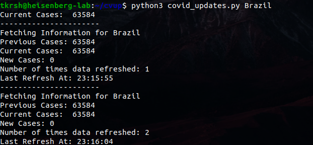

## Get informed about updated COVID-19 cases in your country simply from your terminal
Get informed about updated COVID-19 cases in your country simply from your terminal and send Slack 
messages as a notification along with audio notification whenever a new COVID-19 Case is Detected.
The Script refreshes at 5 seconds interval by default.
Data Source: https://google.com/covid19-map/?hl=en
Slcak Message Format:
### Script Output

## What does this script do ?

    1) Displays live count of COVID-19 cases in your Country.
    2) Displays number of New Cases wrt Previous update
    3) Plays Sound Notification when new Cases are Detected     ** Disabled By Default  To Enable : Uncomment Line 33 
    4) Sends A Slack Message Alert                              ** Disabled By Default  

## Procedure 

    1) Download the script 
    2) Run covid_updates.py in terminal
        - python3 covid_updates.py CountryName SoundPath
    3) To run script in background with slack and music notifications , run in terminal 
        - nohup python3 covid_updates.py &
    4) If Necessory,update refresh intervals by modifying last line of the script, by default it is set 
       to sleep for 5 seconds
 
## Installing Dependencies 
    
    -pip install playsound

### ** To Enable Slack Notification 

    - Get the Slack Access token url and modify the script with your access token url and uncomment following lines [12,27,28,29]

        ex- https://hooks.slack.com/services/xxxxxxxxx
